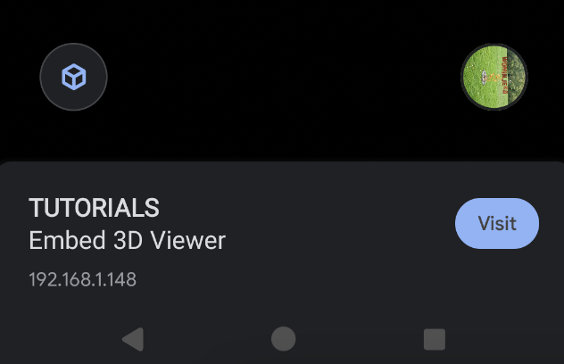
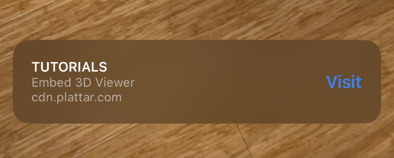

[Back to Home](/)

# AR Banners

With the introduction of `plattar-ar-adapter` version `1.163.1` there are several options that allow displaying and interfacing with AR Banners.

**AR Banners requires the `plattar-ar-adapter` SDK minimum version to be `1.163.1`.**

## Screenshots

AR Banners appear differently on Android and iOS devices:

### Android AR Banner



### iOS AR Banner



## AR Banner Components

AR Banners contain 4 distinct elements:

1. **Title** - This will be the name of your Application and can be changed in the Plattar CMS
2. **Subtitle** - This will be the name of your Scene and can be changed in the Plattar CMS
3. **CTA Button** - This will always be visible and named as `Visit` and cannot be changed. When clicked, the `arclick` event will be fired.
4. **URL** - This will either be the URL of your website or the content CDN URL and cannot be changed

## Enabling AR Banners

### Using Attribute

A new attribute can be used to display the AR Banner when Augmented Reality mode is launched.

| Attribute | Values | Default | Description |
|-----------|--------|---------|-------------|
| **show-ar-banner** | `true` or `false` | `false` | Controls whether to show/hide the AR Banner |

```html
<plattar-embed 
  scene-id="your-scene-id"
  show-ar-banner="true" 
/>
```

### Using Event Listener

Alternatively, a listener can be registered for when the `Visit` button in the AR Banner is clicked. This allows reacting to a user click action and enables coding custom functionality such as:
- Adding products to carts
- Navigating to another page
- Changing some state within the page

**Note:** When the `Visit` button is clicked, the current page will be refreshed so all previous state will be lost. The callback will occur once the page has refreshed.

**Important:** Enabling the callback will automatically set the `show-ar-banner` attribute to `true`.

## Event Listener Example

```html
<plattar-embed id="your_embed_id" scene-id="your_scene_id" />

<script>
  const embed = document.getElementById("your_embed_id");

  // NOTE - adding this listener will set the `show-ar-banner` attribute to `true` automatically
  embed.addEventListener("arclick", () => {
    // the Visit button was clicked, the AR Experience has closed
    // use this listener to react to the event
    console.log("User clicked Visit in AR Banner");
    
    // Example: Track analytics
    // analytics.track("ar_banner_visit_clicked");
    
    // Example: Navigate to product page
    // window.location.href = "/product-details";
    
    // Example: Add to cart
    // addToCart(productId);
  });
</script>
```

## Complete Implementation Example

Here's a full example showing how to use AR Banners with custom functionality:

```html
<!DOCTYPE html>
<html>
<head>
  <title>AR Banner Example</title>
  <script src="https://sdk.plattar.com/plattar-plugin.min.js"></script>
</head>
<body>
  <h1>Product Configurator</h1>
  
  <plattar-embed 
    id="embed"
    scene-id="d9331ec5-3292-4ba9-b632-fab49b29a9e8"
    show-ar="true"
    show-ar-banner="true"
    init="viewer">
  </plattar-embed>

  <script>
    const embed = document.getElementById("embed");

    // Listen for AR Banner click events
    embed.addEventListener("arclick", () => {
      // User clicked the Visit button in AR
      console.log("AR Banner Visit button clicked");
      
      // You can perform any action here:
      // - Track the event
      if (typeof gtag !== 'undefined') {
        gtag('event', 'ar_visit_click', {
          'scene_id': 'd9331ec5-3292-4ba9-b632-fab49b29a9e8'
        });
      }
      
      // - Show a message
      alert("Thank you for viewing in AR!");
      
      // - Navigate to a product page
      // window.location.href = "/product/details";
      
      // - Add product to cart
      // addToCart({ productId: 'xyz', source: 'ar_banner' });
    });

    // Launch AR when button is clicked
    function launchAR() {
      if (PlattarARAdapter.Util.canAugment()) {
        embed.startAR().catch((err) => {
          console.error("Error launching AR:", err);
        });
      } else {
        // Show QR code for non-AR devices
        embed.startQRCode();
      }
    }
  </script>

  <button onclick="launchAR()">View in AR</button>
</body>
</html>
```

## Use Cases

AR Banners are particularly useful for:

- **E-commerce**: Link back to product pages where users can make purchases
- **Marketing Campaigns**: Drive traffic to landing pages
- **Product Information**: Provide additional details after AR viewing
- **Analytics Tracking**: Monitor user engagement with AR experiences
- **Multi-step Flows**: Guide users through a configured experience

## Important Notes

1. **Automatic Activation**: Adding the `arclick` event listener automatically enables the AR Banner
2. **Page Refresh**: The page refreshes when the Visit button is clicked
3. **State Management**: Use URL parameters or session storage to persist state across the refresh
4. **CMS Configuration**: Banner title and subtitle are managed in the Plattar CMS

## Best Practices

- Keep banner titles concise and descriptive
- Use the event listener to track user engagement
- Consider the user journey after they click the Visit button
- Test on both iOS and Android devices as the appearance differs
- Provide clear value in why users should click the Visit button

## Related Guides

- [View in AR](installation/view-ar.md) - How to launch AR experiences
- [API Reference](installation/api-reference.md) - Complete API documentation
