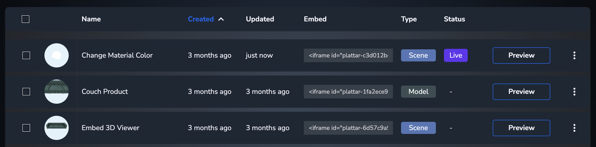

[Back to Home](/)

# Working with Live Scenes

The following examples use the latest version of [plattar-api](https://github.com/Plattar/plattar-api) SDK that allows interfacing with the Plattar REST API.

In Plattar CMS, **Scenes** or **Products** can have their status changed according to readiness or production timings. This example allows fetching scenes that have been set to **Live**.

## Get Live Scenes using Project ID



The following code example shows how to get a list of live scenes from a project.

For the purposes of this example, we use a pre-defined project with id `dae374f0-5dfd-11ec-8865-c5cc93e802d5`

```html
<html>

<head>
  <title>Get All Live Scenes</title>
  <script src="https://cdn.jsdelivr.net/npm/@plattar/plattar-api/build/es2019/plattar-api.min.js"></script>
</head>

<body>
  <script>
    const application = new Plattar.Project("dae374f0-5dfd-11ec-8865-c5cc93e802d5");
    
    // include the scenes in the query
    application.include(Plattar.Scene);

    application.get().then((app) => {
      // grab all scenes
      const scenes = app.relationships.filter(Plattar.Scene);

      // grab all scenes that are live as an array
      const liveScenes = scenes.filter((res) => {
        return res.attributes.custom_json.status === "live";
      });

      // loop and print the ID of scenes
      liveScenes.forEach((scene) => {
        console.log("id: " + scene.id + " title: " + scene.attributes.title);
      });
    }).catch((err) => {
      console.error("Error fetching scenes:", err);
    });
  </script>
</body>

</html>
```

## Get Product/Variation Data from Live Scene

The following example will fetch a list of **Products** and **Variations** from an active scene. This information can be used to initialize other Plattar Embed SDK routines.

```html
<html>

<head>
  <title>Get Products from Live Scenes</title>
  <script src="https://cdn.jsdelivr.net/npm/@plattar/plattar-api/build/es2019/plattar-api.min.js"></script>
</head>

<body>
  <script>
    const application = new Plattar.Project("dae374f0-5dfd-11ec-8865-c5cc93e802d5");
    
    // include the scenes in the query
    application.include(Plattar.Scene);

    application.get().then((app) => {
      // grab all scenes
      const scenes = app.relationships.filter(Plattar.Scene);

      // grab all scenes that are live as an array
      const liveScenes = scenes.filter((res) => {
        return res.attributes.custom_json.status === "live";
      });

      // loop through all active scenes
      liveScenes.forEach((liveScene) => {
        // fetch product and variation from scene
        const scene = new Plattar.Scene(liveScene.id);
        
        // SceneProduct is what is used for curated scenes
        scene.include(Plattar.SceneProduct);
        // Product is what is used against a Model (non curated) scenes
        scene.include(Plattar.Product);
        scene.include(Plattar.SceneProduct.include(Plattar.Product));

        scene.get().then((scene) => {
          const products = scene.relationships.filter(Plattar.Product);

          if (products.length > 0) {
            // print products and variations
            console.log("product-variation for scene " + scene.attributes.title);
            
            products.forEach((product) => {
              console.log("product_id=" + product.id + "\nvariation_id=" + product.attributes.product_variation_id);
            });
          }
        }).catch((err) => {
          console.error("Error fetching scene products:", err);
        });
      });
    }).catch((err) => {
      console.error("Error fetching application:", err);
    });
  </script>
</body>

</html>
```

## Practical Use Cases

### Dynamic Scene Selection

You can use this to dynamically populate a scene selector:

```javascript
// Fetch live scenes
application.get().then((app) => {
  const scenes = app.relationships.filter(Plattar.Scene);
  const liveScenes = scenes.filter((res) => {
    return res.attributes.custom_json.status === "live";
  });

  // Populate a dropdown with live scenes
  const selector = document.getElementById("scene-selector");
  
  liveScenes.forEach((scene) => {
    const option = document.createElement("option");
    option.value = scene.id;
    option.textContent = scene.attributes.title;
    selector.appendChild(option);
  });
});
```

### Building a Product Catalog

Use live scenes to build a dynamic product catalog:

```javascript
application.get().then((app) => {
  const scenes = app.relationships.filter(Plattar.Scene);
  const liveScenes = scenes.filter((res) => {
    return res.attributes.custom_json.status === "live";
  });

  const catalog = document.getElementById("product-catalog");

  liveScenes.forEach((liveScene) => {
    const scene = new Plattar.Scene(liveScene.id);
    scene.include(Plattar.SceneProduct);
    scene.include(Plattar.SceneProduct.include(Plattar.Product));

    scene.get().then((scene) => {
      const products = scene.relationships.filter(Plattar.Product);

      products.forEach((product) => {
        // Create product card
        const card = document.createElement("div");
        card.className = "product-card";
        card.innerHTML = `
          <h3>${scene.attributes.title}</h3>
          <button onclick="loadScene('${scene.id}', '${product.id}')">
            View Product
          </button>
        `;
        catalog.appendChild(card);
      });
    });
  });
});

function loadScene(sceneId, productId) {
  const embed = document.getElementById("embed");
  embed.setAttribute("scene-id", sceneId);
  embed.setAttribute("variation-id", productId);
}
```

## Error Handling

Always include proper error handling when working with the API:

```javascript
application.get().then((app) => {
  // Success handling
  const scenes = app.relationships.filter(Plattar.Scene);
  
  if (scenes.length === 0) {
    console.warn("No scenes found in this project");
    return;
  }
  
  const liveScenes = scenes.filter((res) => {
    return res.attributes.custom_json.status === "live";
  });
  
  if (liveScenes.length === 0) {
    console.warn("No live scenes found");
    return;
  }
  
  // Process scenes...
  
}).catch((err) => {
  console.error("Error fetching data:", err);
  
  // Show user-friendly error message
  document.getElementById("error-message").textContent = 
    "Unable to load scenes. Please try again later.";
});
```

## Related Guides

- [Get Product SKU](guides/get-product-sku.md) - Working with product SKUs
- [API Reference](installation/api-reference.md) - Complete API documentation
- [Plattar API Documentation](https://github.com/Plattar/plattar-api) - Full API SDK documentation
