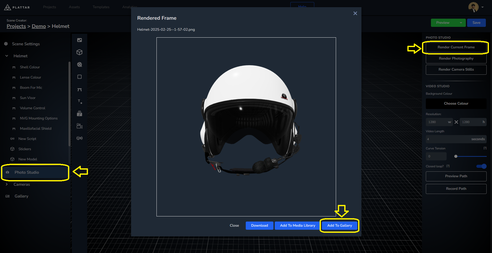
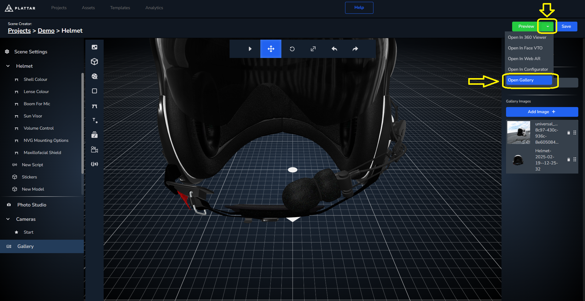
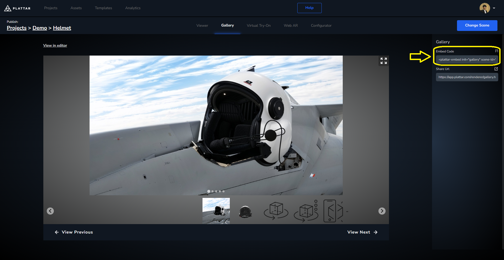
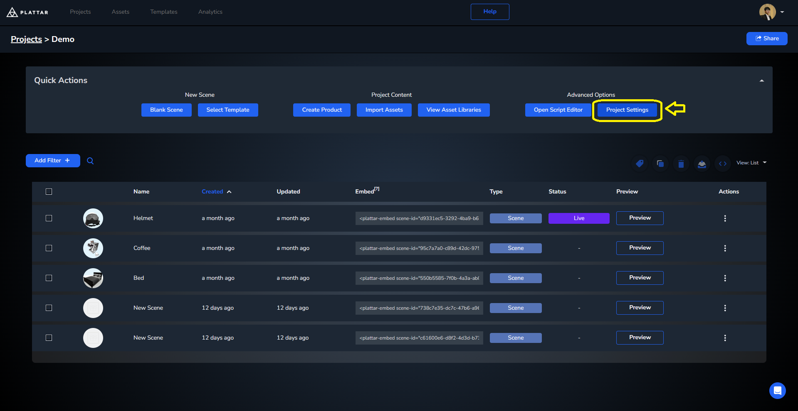
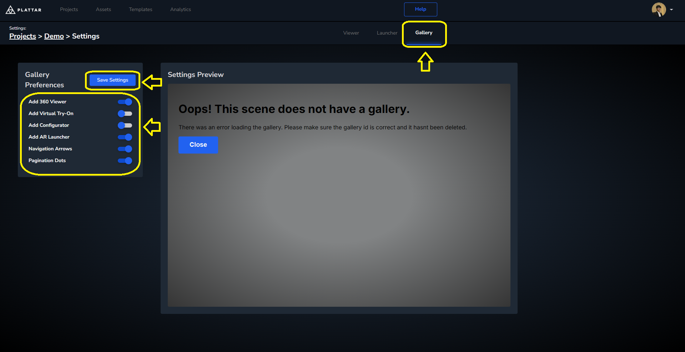

[Back to Home](/)

# Adding Gallery

The Gallery system is a new addition to the Plattar platform allowing users to view a set of images in addition to the 3D Viewer. This allows a much more seamless integration of a product catalogue from a single source rather than having the viewer and gallery come from different providers.

## Adding a Gallery to Existing Project

Before the gallery can function, we need to add images to it first. The images can either be uploaded in the Scene Editor or be rendered from the scene using the Photo Studio.

### Upload Images


To add a user-sourced image:
1. Go to `Gallery > Add Image > Upload Image > Select`

### Render from Scene



To render a frame from the scene:
1. Go to `Photo Studio > Render Current frame > Add to Gallery`

## Adding the Gallery

To add a gallery into your website, the Plattar Plugin offers an embed link you can copy from the CMS.

### Step 1: Navigate to Gallery Preview

Firstly, navigate to the gallery preview by going to `Preview > Gallery`:



### Step 2: Copy Embed Code

Then you can copy the embed link from `Embed Code`:



### Step 3: Add to Website

Once you've collected the embed code you add it to your website with the install script to make it functional:

```html
<script src="https://sdk.plattar.com/plattar-plugin.min.js"></script>

<plattar-embed init="viewer" scene-id="d9331ec5-3292-4ba9-b632-fab49b29a9e8" embed-type="gallery"></plattar-embed>
```

## Switching Between Viewer and Gallery

Another way to view the gallery is by switching to the gallery from an existing Viewer.

### Step 1: Setup Basic Scene

We'll first setup the basic scene by adding the embed script and the install script. We'll also add an attribute `id` with `embed` as its value so we can find it later:

```html
<script src="https://sdk.plattar.com/plattar-plugin.min.js"></script>

<plattar-embed id="embed" init="viewer" scene-id="d9331ec5-3292-4ba9-b632-fab49b29a9e8" embed-type="viewer"></plattar-embed>
```

### Step 2: Add Toggle Button

We'll also add a button that allows us to switch between the Gallery and the Viewer:

```html
<button type="button" onclick="toggleGallery()">Switch Between Gallery and Viewer</button>
```

### Step 3: Get Embed Reference

Going into JavaScript, we'll first acquire the embed through tag and create the previous function that we already set in the button:

```javascript
const embed = document.getElementById("embed");

function toggleGallery() {
}
```

### Step 4: Implement Toggle Logic

Finally we'll use `setAttribute(attribute, value)` to change the `embed-type` attribute between `gallery` and `viewer` to switch between the gallery and viewer embed. We'll also need `getAttribute(attributeName)` to find out what the current attribute value is:

```javascript
function toggleGallery() {
  if (embed.getAttribute("embed-type") !== "gallery") {
    embed.setAttribute("embed-type", "gallery");
  }
  else {
    embed.setAttribute("embed-type", "viewer");
  }
}
```

## Changing the Gallery Settings

Finally, the gallery function on top of being able to show pictures can also show the viewer inside itself in addition to other extra features such as Virtual Try-On, and AR Launcher.

To enable these settings from your scene:
1. Go back to your Project > Project settings > Gallery > Change settings > Save Settings





## Next Step

Next we will show a final example bringing together all the features we have implemented in this guide.

[Go to next step](installation/final-example.md)
