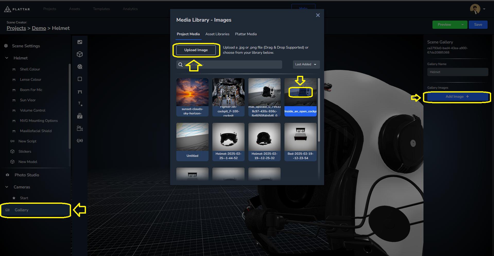

[Back to Main](./)


# Adding Gallery

The Gallery system is a new addition to the plattar platform allowing users to see a set of images in addition to the 3D Viewer. This allows a much more seamless integration of product catalogue from a single source rather than having the viewer and gallery came form different providers.

## Adding a Gallery to existing project

Before the gallery can function, we need to add images to it first.
The image can either be user sourced or be rendered from the scene using the Photo Studio.

To add a user sourced image, go to gallery > Add Image >  Upload Image > Select


To render a frame from the scene go to photo studio > Render Current frame > Add to Gallery


## Adding the Gallery
To add a gallery into your website, PLattar plugin offer an embed link you can copy from the CMS.
first navigate to the gallery preview by going to Preview > Gallery

Then You can copy the embed link from `Embed Code`

Once you've collected the embed code you add it to your website with the install script to make it functional.
```html

<script src="https://sdk.plattar.com/plattar-plugin.min.js"></script>

<plattar-embed init="viewer" scene-id="d9331ec5-3292-4ba9-b632-fab49b29a9e8" embed-type="gallery"></plattar-embed>

```

## Switching Between Viewer and Gallery

Another way to view the gallery is by switching to the gallery from an existing Viewer.
- We'll first setup the basic scene by adding the embed script and the install script. We'll also add an attribute `id` with `embed` as it value so we can find them later.
    ```html

    <script src="https://sdk.plattar.com/plattar-plugin.min.js"></script>

    <plattar-embed id="embed" init="viewer" scene-id="d9331ec5-3292-4ba9-b632-fab49b29a9e8" embed-type="gallery"></plattar-embed>

    ```
- We'll also add a button that allow us to switch betwen the Gallery and the Viewer.
    ```html
    <button type="button" onclick="toggleGallery()">Switch Between Galllery and Viewer</button>
    ```
- Going into javascript, we'll first acquire the embed through tag and create the previous function that we already set in the button
    ```javascript
    const embed = document.getElementById("embed");

    function toggleGallery() {
    }
    ```
- finally we'll use `setAttribute(attribute, value)` to change the `init` attribute between `gallery` and `viewer` to switch between the gallery and viewer embed. We'll also need  `getAttribute(attributeName)` to find out what the current attribute value is.

    ```javascript
    const embed = document.getElementById("embed");


    function toggleGallery() {
        if (embed.getAttribute("embed-type") !== "gallery" ) {
            embed.setAttribute("embed-type", "gallery")
        }
        else{
            embed.setAttribute("embed-type", "viewer")
        }
    }"
    ```


## Changing the Gallery Settings
Finally, The gallery function ontop of being able to show pictures can also show the viewer inside itself in addition to other extra features such as Virtual Try-On, and AR Launcher.

To enable these settings from your scene, go back to your Project >  Project settings > Gallery > Change settings > Save Settings.


