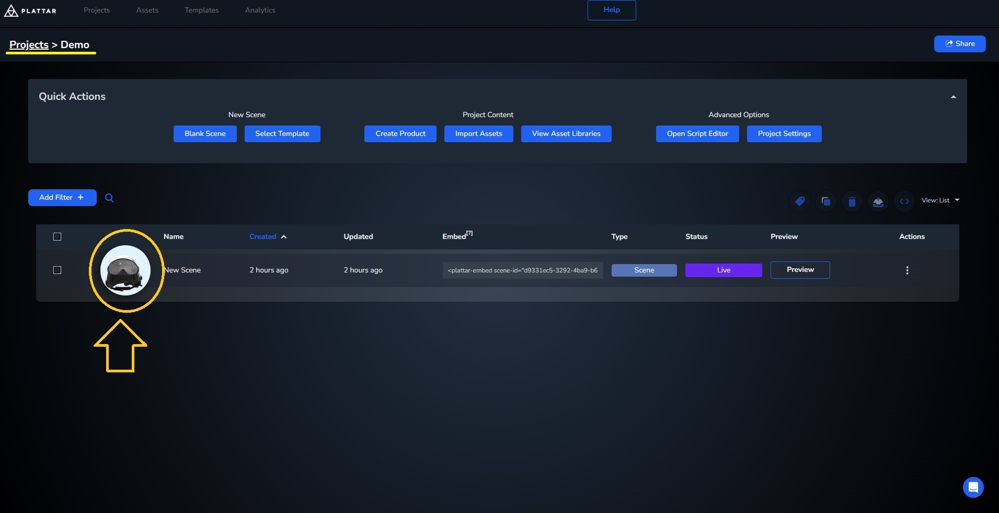
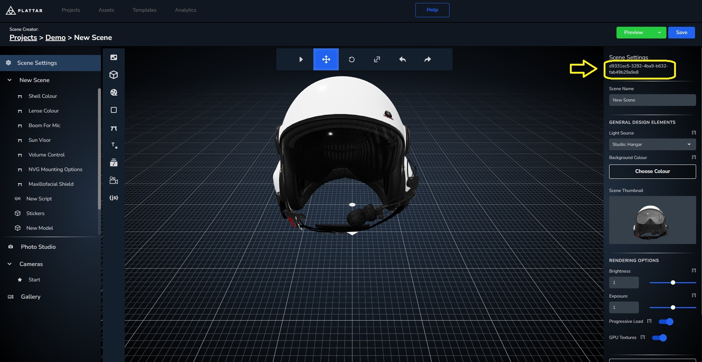

[Back to Main](./)


# Changing Between Scenes

In the [previous step](./loading-scene.md), we get the scene embed tag with `scene-id` and other mandatory attributes through the CMS. During runtime, we can change this `scene-id` to swap between different scenes. The renderer will automatically change scenes when the `scene-id` is changed.

## Getting the Scene ID

Before we start, we first have to get a `Scene ID` from multiple scenes we'd like to change between. The `Scene ID` can be copied directly from the Plattar CMS. This ID is fixed and will not change when the scene is modified. Each Scene has a unique UUID (Universally Unique Identifier).

- From the scene list, click on your Scene to enter the Scene Editor
  

- Copy the `Scene ID` from the Scene Editor and use as part of the `scene-id` attribute in the integration (the same way you would copy the embed tag)
  

## Changing the Scene using Scene ID

Now we have the new `Scene ID`, we can now change the `scene-id` attribute directly in the embed. The Plattar plugin will automatically change the scene whenever the `scene-id` attribute is changed.

- Start by removing the `show-ui` attribute as we'll be creating our own buttons. We'll also add an ID to the html tag so we can select it using javascript.
  ```html
    <script src="https://sdk.plattar.com/plattar-plugin.min.js"></script>

    <!-- remove show-ui="true" and added id="embed" -->
    <plattar-embed id="embed" scene-id="d9331ec5-3292-4ba9-b632-fab49b29a9e8" init="viewer"></plattar-embed>
    ```
- Next, we'll add a section above the embed with buttons and text. We'll use these buttons to call the scene change functions.
  ```html
    <script src="https://sdk.plattar.com/plattar-plugin.min.js"></script>

    <!-- Section containing buttons which will call the scene switching -->
    <div>
      <p>Scene Selection</p>
      <button>Helmet</button>
      <button >Bed</button>
      <button >Coffee Machine</button>
    </div>

    <plattar-embed id="embed" scene-id="d9331ec5-3292-4ba9-b632-fab49b29a9e8" init="viewer"></plattar-embed>
    ```

- Now we'll add a `value` and `onclick` attribute to these buttons. Each of these buttons should have a `value` equal to the `scene-id` from the [CMS](#getting-the-scene-id). The `onclick` attributes should call `selectScene(this.value)` which will pass over the `value` attribute we set.

  ```html
    <script src="https://sdk.plattar.com/plattar-plugin.min.js"></script>

    <div>
      <p>Scene Selection</p>
      <!-- button value contains scene-id obtained through the CMS -->
      <button value="d9331ec5-3292-4ba9-b632-fab49b29a9e8" onclick="selectScene(this.value)">Helmet</button>
      <!-- These buttons will use their value as parameter to call selectScene()-->
      <button value="550b5585-7f0b-4a3a-ab01-dc5b27741372" onclick="selectScene(this.value)">Bed</button>
      <button value="95c7a7a0-c89d-42dc-9752-102c36475413" onclick="selectScene(this.value)">Coffee Machine</button>
    </div>

    <plattar-embed id="embed" scene-id="d9331ec5-3292-4ba9-b632-fab49b29a9e8" init="viewer"></plattar-embed>
    ```

- Once we have the HTML setup we can move into the javascript. We'll first get the embed tag through an ID.
  ``` javascript
  // Obtain the embed through the ID we've added
  const embed = document.getElementById("embed");
  ```


- Now, we can add `selectScene(id)` function which gets called by the buttons we've made earlier, passing over the `scene-id`.
  ``` javascript
  const embed = document.getElementById("embed");

  //create an empty function which will be called by the buttons we've added
  function selectScene(id) {}
  ```

- Finally, to change scene we'll be changing the `scene-id` attribute from the embed tag using `setAttribute(attribute, value)`.

  ``` javascript
  const embed = document.getElementById("embed");

  function selectScene(id) {
    //using setAttribute(), we'll change the scene into the ones we've added as value for the buttons
    embed.setAttribute("scene-id", id);
  }
  ```

#### Changing Scenes Final Result
<iframe height="600" style="width: 100%;" scrolling="no" title="Changing Scene" src="https://codepen.io/plattar/embed/raBqJMb?default-tab=html%2Cresult&editable=true" frameborder="no" loading="lazy" allowtransparency="true" allowfullscreen="true">
  See the Pen <a href="https://codepen.io/plattar/pen/raBqJMb">
  Changing Scene</a> by Plattar (<a href="https://codepen.io/plattar">@plattar</a>)
  on <a href="https://codepen.io">CodePen</a>.
</iframe>
