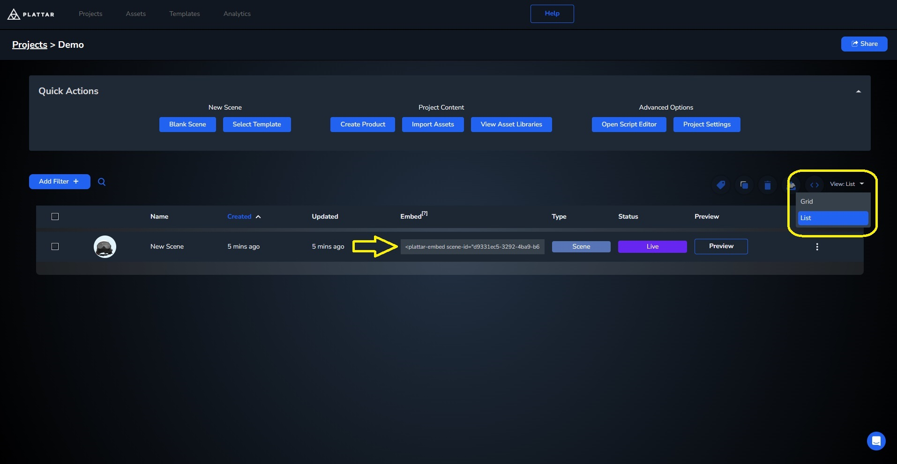

[Back to Main](./)

# Loading a Scene


[Jump to final result](#changing-scenes-final-result)

## Quick Start

To start, we'll begin with a simple example showing a basic 3D Viewer.

- First, we'll need to [install](../installation/installation.md) the plattar plugin, which can be done by adding the following code into your website `<head>` tag:

  ```html
  <!-- install the plugin using a script tag  -->
  <script src="https://sdk.plattar.com/plattar-plugin.min.js"></script>
  ```

- Next, we'll need to add an embed code that will show the 3d viewer. Luckily, The CMS can provide you with the embed tag you need, complete with its scene ID with only a few clicks
  {1000px}
  To access an embed code from a scene, navigate to your project page, change the view setting to list, and copy the embed code by clicking on it

- Once we get the embed code we can now add it into our website like so

  ```html
  <script src="https://sdk.plattar.com/plattar-plugin.min.js"></script>
  <!-- the embed code obtained through the CMS -->
  <plattar-embed scene-id="d9331ec5-3292-4ba9-b632-fab49b29a9e8" init="viewer"></plattar-embed>
  ```
- Finally, for a quick implementation, we can use Plattar's built in UI to add full functionality to our embed, including variation change and AR viewer. To do so we'll simply need to add ```show-ui="true"```.

  ```html
  <script src="https://sdk.plattar.com/plattar-plugin.min.js"></script>
  <!-- add the show-ui = "true" to use plattar's default UI -->
  <plattar-embed show-ui="true" scene-id="d9331ec5-3292-4ba9-b632-fab49b29a9e8" init="viewer"></plattar-embed>
  ```

### Loading a Scene Result
<iframe height="600" style="width: 100%;" scrolling="no" title="Quick Start" src="https://codepen.io/plattar/embed/JoPaOge?default-tab=html%2Cresult&editable=true" frameborder="no" loading="lazy" allowtransparency="true" allowfullscreen="true">
  See the Pen <a href="https://codepen.io/plattar/pen/JoPaOge">
  Quick Start</a> by Plattar (<a href="https://codepen.io/plattar">@plattar</a>)
  on <a href="https://codepen.io">CodePen</a>.
</iframe>

