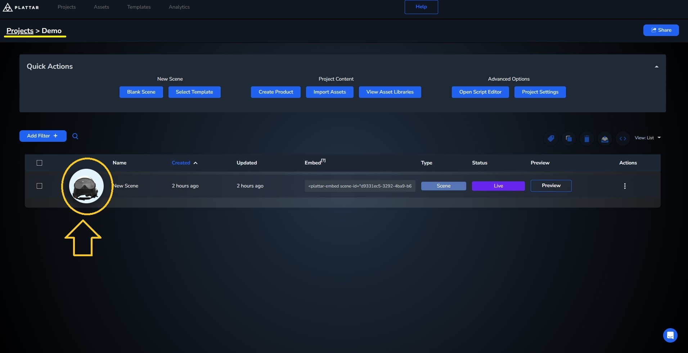

[Back to Main](./)

# Loading a Scene


[Jump to final result](#final-result)

## Quick start

To start, we'll begin with a simple example showing the most basic example for a 360 renderer 

- First, we'll need to [install](../installation/installation.md) the plattar plugin, which can easily be done by adding this embed code into your website
  
  ```html
  <script src="https://sdk.plattar.com/plattar-plugin.min.js"></script>
  ```

- Next, we'll need to add an embed code that will show the 3d model. Luckily, The CMS can provide you with the embed tag you need, complete with its scene ID with only a few clicks
  
  To access an embed code from a scene, navigate to your project page, change the view setting to list, and copy the embed code by clicking on it 

- Once we get the embed code we can now add it into our website like so

  ```html
  <script src="https://sdk.plattar.com/plattar-plugin.min.js"></script>
  <plattar-embed id = "embed" scene-id="d9331ec5-3292-4ba9-b632-fab49b29a9e8" init="viewer" ></plattar-embed>
  ```
- Finally, for a quick implementation, we can use Plattar's built in UI to add full functionality to our embed, including variation change and AR viewer.To do so we'll simply add ```show-ui="true"```.

  ```html
  <script src="https://sdk.plattar.com/plattar-plugin.min.js"></script>
  <plattar-embed show-ui = "true" id = "embed" scene-id="d9331ec5-3292-4ba9-b632-fab49b29a9e8" init="viewer"  ></plattar-embed>
  ```

### QuickStart Final Result
<iframe height="600" style="width: 100%;" scrolling="no" title="Quick Start" src="https://codepen.io/plattar/embed/JoPaOge?default-tab=html%2Cresult&editable=true" frameborder="no" loading="lazy" allowtransparency="true" allowfullscreen="true">
  See the Pen <a href="https://codepen.io/plattar/pen/JoPaOge">
  Quick Start</a> by Plattar (<a href="https://codepen.io/plattar">@plattar</a>)
  on <a href="https://codepen.io">CodePen</a>.
</iframe>

## Changing Between Scenes

In the first example, we get the embed tag with `scene-id` attribute and other mandatory attributes through the CMS. During runtime, we can change this scene ID to change between multiple scenes. The renderer will automatically change between scenes when a new `scene-id` is loaded 

### Getting the Scene ID

Before we start, we first have to get a `Scene ID` from multiple scenes we'd like to change between. The `Scene ID` can be copied directly from the Plattar CMS just like the full embed tag. This ID is static for the duration of the Scene's existance and will not change when the scene is modified. Each Scene contains a unique GUID (Global Unique Identifier).

- Click on your Scene to enter the Scene Editor 
  

- Copy the `Scene ID` from the Scene Editor and use as part of the `scene-id` attribute in the integration (this is not disimilar to copying the embed tag)
  

### Changing the Loaded Scene using Scene ID

Once we've acquired the `Scene ID`, we can now change the `scene-id` directly in the embed. the Plattar plugin will automaticallly change the loaded scene whenever the `scene-id` is changed.

In this example we use a simple drop-down selector to change between 3 scenes

<iframe height="600" style="width: 100%;" scrolling="no" title="Changing Scene" src="https://codepen.io/plattar/embed/raBqJMb?default-tab=html%2Cresult&editable=true" frameborder="no" loading="lazy" allowtransparency="true" allowfullscreen="true">
  See the Pen <a href="https://codepen.io/plattar/pen/raBqJMb">
  Changing Scene</a> by Plattar (<a href="https://codepen.io/plattar">@plattar</a>)
  on <a href="https://codepen.io">CodePen</a>.
</iframe>
