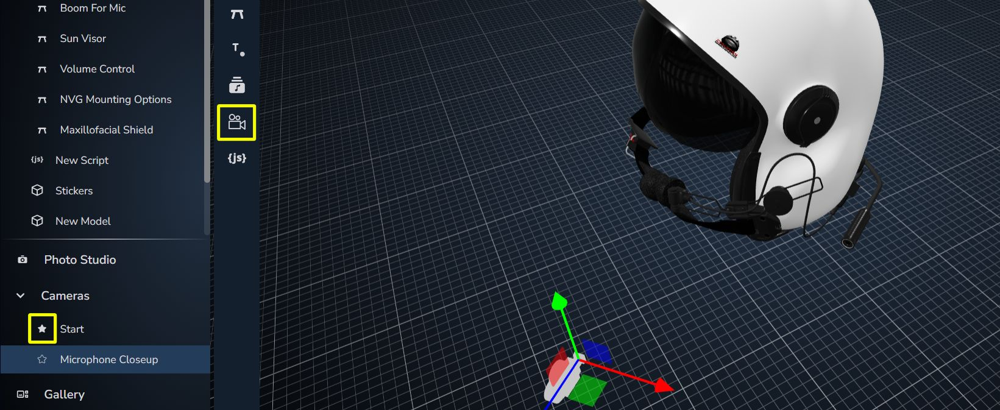
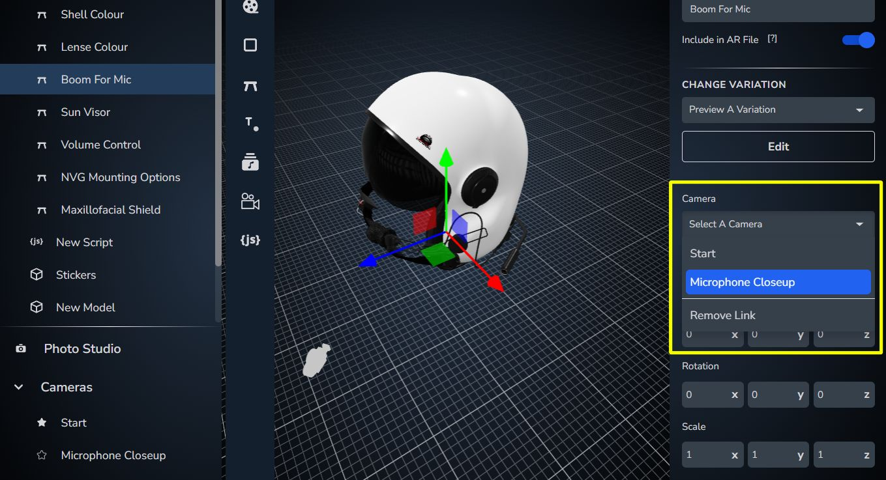
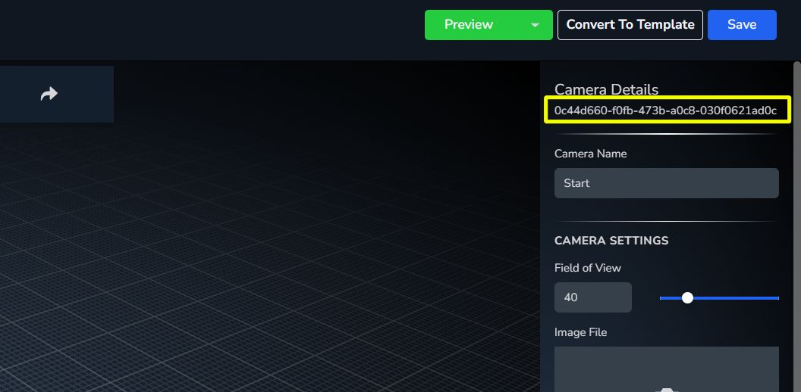

[Back to Home](/)

# Moving to a Camera

[Jump to final result](#moving-camera-result)

In the Plattar Scene Editor, you can drag and position cameras in the scene to focus on different views of your models. You can select one camera to be the default one upon loading, and all cameras will have IDs that can be used to move the current perspective to that camera. Also in the scene editor, you can assign a camera to a configurable product so the Viewer will automatically move to that camera if that product's variation is changed.

## Setting a Default Camera

To set a camera to be default, first add a camera into your scene then click on the star button next to its name in the camera list.



## Setting a Product's Camera

You can assign a camera to a product in order to move to this camera when a variant of that product is selected. To do this:

1. Select the product in your object list
2. In the property inspector select the camera you want from the camera drop-down list



## Moving to a Camera Using Code

The Plattar plugin provides a few options for moving the current view to a camera positioned in the scene. You can use either method `snapToCamera(camera_id)` to instantly move the camera or `moveToCamera(camera_id)` to animate smoothly over one second to the camera position. 

You will have to get your camera IDs from the Scene Editor and get a reference to the plattar-embed.



### Example Code

```javascript
const embed = document.getElementById("embed");
const start_camera_id = '0c44d660-f0fb-473b-a0c8-030f0621ad0c';
const mic_camera_id = 'db331f14-93e9-4f4f-9228-7f8e6b06e317';

// Move camera instantly
function snapToCamera(camera_id) {
  embed.viewer.messenger.snapToCamera(camera_id);
}

// Animate camera
function moveToCamera(camera_id) {
  embed.viewer.messenger.moveToCamera(camera_id);
}
```

## Moving to a Programmed Position

For larger projects where you don't want to add cameras to your scenes or have a more technical understanding of 3D graphics, you can move your camera directly using Vector3 positions and Quaternion rotations. This is for more advanced users as you will need to consider the size of the content in the scenes.

### Example Code

```javascript
const embed = document.getElementById("embed");
const position = {x: 0, y: 50, z: 200};
const quaternion = {x: 0, y: 0, z: 0, w: 1};

// Move camera instantly
function snapToPosition(position, quaternion) {
  const transform = {
    position,
    quaternion
  };
  embed.viewer.messenger.snapToPosition(transform);
}

// Animate camera
function moveToPosition(position, quaternion) {
  const transform = {
    position,
    quaternion
  };
  embed.viewer.messenger.moveToPosition(transform);
}
```

## Moving Camera Result

<iframe height="600" style="width: 100%;" scrolling="no" title="Moving Camera Result" src="https://codepen.io/plattar/embed/RNNNPXq?default-tab=html%2Cresult&editable=true" frameborder="no" loading="lazy" allowtransparency="true" allowfullscreen="true">
  See the Pen <a href="https://codepen.io/plattar/pen/JoPaOge">
  Quick Start</a> by Plattar (<a href="https://codepen.io/plattar">@plattar</a>)
  on <a href="https://codepen.io">CodePen</a>.
</iframe>

## Next Step

Next we will go over how to take screenshots of the 3D scene.

[Go to next step](installation/screenshot.md)
