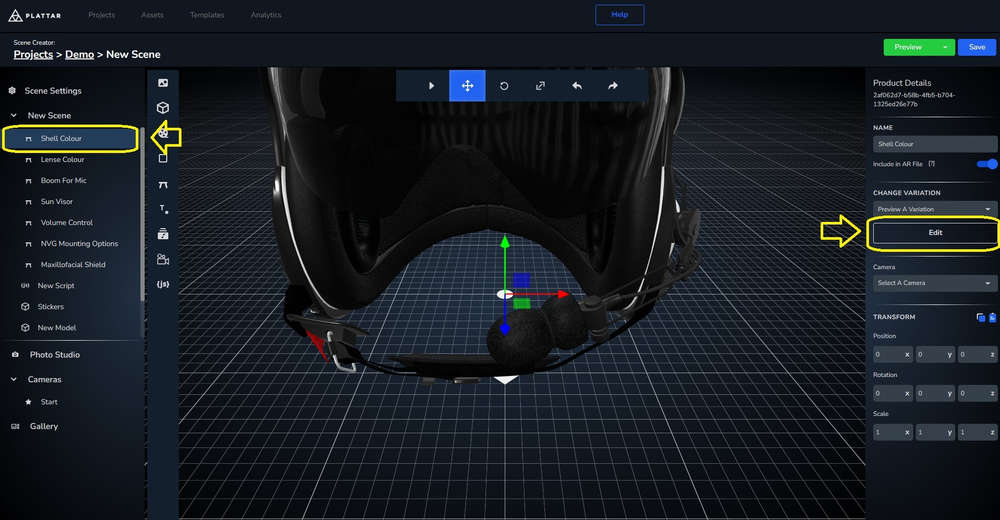
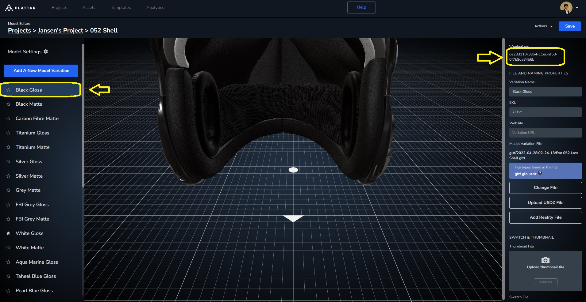

[Back to Main](./)


## Selecting Variation ID
While changing between scenes work for multiple different products, sometimes products are more a variation of each other rather than a different object entirely. In which case we'll instead change between variations rather than changing the scene entirely

### Getting Variation ID
Just like changing scenes, before we can change variation we first have to get their IDs. For a variation in a scene, the `Variation ID` can be copied from the Plattar CMS through the editor, in a similar way that we get `Scene ID`.

- Navigate to the editor of a scene you'd like to get the `variation-id` from

- Select an object in the scene you'd like to change to a variation
{ width=1000px }

- In the variation Editor, select the variation and copy the `Variation ID`. Use this ID to change between variations either by updating the attribute or using the JavaScript function.
{ width=1000px }


### Changing Variation Using Attribute
There are two ways to change a variation in a scene, either by changing the [attribute](../guides/node-attributes.md) of the embed or using a JavaScript [function](../guides/node-attributes.md).

In the first example, we'll use attributes to change between  `Variation ID`s

- First, just like in the basic example we'll get the embed tag through the CMS and install the plattar plugin through a script tag. (If you need a refresher, you can go back to the [basic example](./loading-scene.md/#changing-between-scenes))

  ```html
  <!-- Installing the PLattar Plugin -->
  <script src="https://sdk.plattar.com/plattar-plugin.min.js"></script>

  <!-- The embed code acquired from the CMS -->
  <plattar-embed id="embed" scene-id="d9331ec5-3292-4ba9-b632-fab49b29a9e8" init="viewer" height="700px"></plattar-embed>
  ```

- Next, let's add buttons to select the variations. In the scene we have for this example, we'll be changing the shell, lens, and mic between a handful of options.

  ```html
  <!-- Added a section containing all the needed button to change bewteen variation -->
  <section>
    <p>Shell Colour</p>
    <div>
      <button>White Gloss</button>
      <button>Black Matte</button>
      <button>Taheel Blue Gloss</button>
      <button>Carbon Fibre Matte</button>
    </div>

    <p>Lens Colour</p>
    <div>
      <button>Grey</button>
      <button>Clear</button>
      <button>Gold</button>
      <button>Ice</button>
    </div>

    <p>Microphone Choice</p>
    <div>
      <button>Flex Boom</button>
      <button>Wire Rail</button>
    </div>
  </section>
  ```

- Just like in the changing scene [example](loading-scene.md) we'll use the `value` in our buttons to hold our `variation-id` for changing between variations in shells, lenses and microphones.

  ```html
  <section>
    <p>Shell Colour</p>
    <div>
      <!-- The button value contain a variation-id obtained from the CMS -->
      <!-- On click, these buttons will use its value as a variable to call selectVariation() -->
      <button type="button" value="936639e0-3854-11ec-b8ed-8d91c3e5372d" onclick="selectVariation(this.value)">White Gloss</button>
      <button type="button" value="00d19f50-3855-11ec-ad9f-f7fd41a04008" onclick="selectVariation(this.value)">Black Matte</button>
      <button type="button" value="315beb90-990a-11ec-94ac-bb29596fb341" onclick="selectVariation(this.value)">Taheel Blue Gloss</button>
      <button type="button" value="41e79050-99dd-11ec-839d-974669311e2e" onclick="selectVariation(this.value)">Carbon Fibre Matte</button>
    </div>

    <p>Lens Colour</p>
    <div>
      <button type="button" value="11d66560-3856-11ec-ac17-edcbe6ab5f51" onclick="selectVariation(this.value)">Grey</button>
      <button type="button" value="008b84c0-3856-11ec-b231-53e63b05f28d" onclick="selectVariation(this.value)">Clear</button>
      <button type="button" value="08b1cdf0-3856-11ec-81ea-6db89c21ded2" onclick="selectVariation(this.value)">Gold</button>
      <button type="button" value="19ceb2f0-3856-11ec-b5fe-99005f0f10da" onclick="selectVariation(this.value)">Ice</button>
    </div>

    <p>Microphone Choice</p>
    <div>
      <button type="button" value="9e72b970-952f-11ec-b235-99fb2ff9be07" onclick="selectVariation(this.value)">Flex Boom</button>
      <button type="button" value="9e7431d0-952f-11ec-83d1-c1a06c185e57" onclick="selectVariation(this.value)">Wire Rail</button>
    </div>
  </section>
  ```

- Moving into the javascript, as with the changing scene example, we'll first find the embed tag through it's `id`

  ```javascript
  //get the embed tag using id
  const embed = document.getElementById("embed");
  ```

- Then, using `setAttribute(attribute, value)` to change the `variation-id`, which we've set to be called by the buttons when clicked.

  ```javascript
  //Function used to change between variation-ids
  function selectVariation(id) {
    //using setAttribute()
    embed.setAttribute("variation-id", id)
  }
  ```

#### Changing Variation Using Attribute Final Result
<iframe height="600" style="width: 100%;" scrolling="no" title="Changing Variation Using Function" src="https://codepen.io/plattar/embed/mybzxVK?default-tab=js%2Cresult&editable=true" frameborder="no" loading="lazy" allowtransparency="true" allowfullscreen="true">
  See the Pen <a href="https://codepen.io/plattar/pen/mybzxVK">
  Changing Variation Using Function</a> by Plattar (<a href="https://codepen.io/plattar">@plattar</a>)
  on <a href="https://codepen.io">CodePen</a>.
</iframe>


### Changing Variation Using Function
In this example, we'll use function instead which offers better redundency and error handling

- We'll first start from the HTML we've used in the previous [example](#changing-variation-using-attribute)

  ```html
  <script src="https://sdk.plattar.com/plattar-plugin.min.js"></script>

  <section>
    <div>
      <p>Shell Colour</p>
      <button type="button" value="936639e0-3854-11ec-b8ed-8d91c3e5372d" onclick="selectVariation(this.value)">White Gloss</button>
      <button type="button" value="00d19f50-3855-11ec-ad9f-f7fd41a04008" onclick="selectVariation(this.value)">Black Matte</button>
      <button type="button" value="315beb90-990a-11ec-94ac-bb29596fb341" onclick="selectVariation(this.value)">Taheel Blue Gloss</button>
      <button type="button" value="41e79050-99dd-11ec-839d-974669311e2e" onclick="selectVariation(this.value)">Carbon Fibre Matte</button>
    </div>

    <div>
      <p>Lens Colour</p>
      <button type="button" value="11d66560-3856-11ec-ac17-edcbe6ab5f51" onclick="selectVariation(this.value)">Grey</button>
      <button type="button" value="008b84c0-3856-11ec-b231-53e63b05f28d" onclick="selectVariation(this.value)">Clear</button>
      <button type="button" value="08b1cdf0-3856-11ec-81ea-6db89c21ded2" onclick="selectVariation(this.value)">Gold</button>
      <button type="button" value="19ceb2f0-3856-11ec-b5fe-99005f0f10da" onclick="selectVariation(this.value)">Ice</button>
    </div>

    <div>
      <p>Mic Choice</p>
      <button type="button" value="9e72b970-952f-11ec-b235-99fb2ff9be07" onclick="selectVariation(this.value)">Flex Boom</button>
      <button type="button" value="9e7431d0-952f-11ec-83d1-c1a06c185e57" onclick="selectVariation(this.value)">Wire Rail</button>
    </div>
  </section>

  <section>
    <div>
      <plattar-embed id="embed" scene-id="d9331ec5-3292-4ba9-b632-fab49b29a9e8" init="viewer" height="700px" ></plattar-embed>
    </div>
  </section>

  ```
- Unlike the previous example which uses `setAttribute(attribute, value)`, we'll instead use a [function](./api-reference.md/#functions) from the plugin, `viewer.messenger.selectVariationID (variationID:string|Array<string>)`.

  ```javascript
  const embed = document.getElementById("embed");

  function selectVariation(id) {
    //instead of chanigng attirbute we canuse plattar plugin built in selectVariationID()
    embed.viewer.messenger.selectVariationID(id);
  }
  ```

#### Changing Variation Using function Final Result
<iframe height="600" style="width: 100%;" scrolling="no" title="Changing variation Using Attribute" src="https://codepen.io/plattar/embed/RNbeQdx?default-tab=js%2Cresult&editable=true" frameborder="no" loading="lazy" allowtransparency="true" allowfullscreen="true">
  See the Pen <a href="https://codepen.io/plattar/pen/RNbeQdx">
  Changing Variant Using Attribute</a> by Plattar (<a href="https://codepen.io/plattar">@plattar</a>)
  on <a href="https://codepen.io">CodePen</a>.
</iframe>

### Next Step
Next we will go over how to select and load variations using a user defined SKU property.
[Go to next step](./selecting-variation-sku.md)