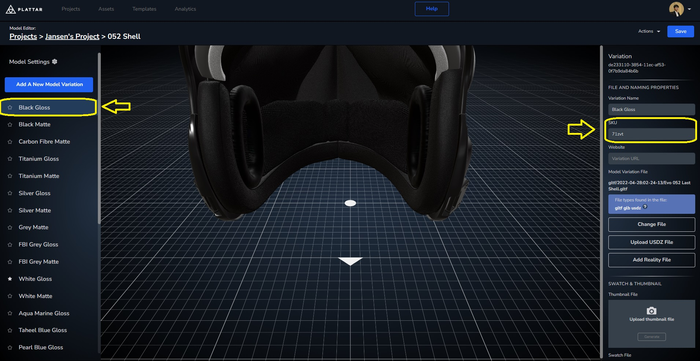

[Back to Main](./)


## Selecting Variation SKU
While changing between `variation-id`, as they are automatically generated they're often long and cumbersome. It's more helpful if they were instead defined by the users themselves, as such the plattar PLugin also allow the use of user defines `SKU` instead of an automatically generated `variation-id`

### Getting Variation SKU

Instead of getting an ID, in this guide we'll use a user defined SKU. For variation in a single scene, the `SKU` can be defined by the user and be copied from the Plattar CMS through the editor, not too disimilar to `Scene ID` and `variation-id`

- Navigate to the editor of a scene you'd like to get the `SKU` from

- Select an object in the scene you'd like to change to a variation
{ width=1000px }

- In the variation Editor, pick one of the variation available, define an SKU by typing it into the textbox if not already set, copy the `SKU`, and use it to change between variations either by changing the attribute or using a function
{ width=1000px }


### Changing Variation Using Attribute
There are multiple ways to change a variation in a scene, either by changing the [attribute](../guides/node-attributes.md) of the embed or through a [function](../guides/node-attributes.md). 


In the first example, we'll use attributes to change between `SKU`

- First, just like in the basic example we'll get the embed tag through the CMS and install the plattar plugin through a script tag. (If you need a refresher, you can go back to the [basic example](./loading-scene.md/#changing-between-scenes))
  
  ```html
  <!-- Installing the PLattar Plugin -->
  <script src="https://sdk.plattar.com/plattar-plugin.min.js"></script>
  
  <section>
    <div>
    <!-- The embed code acquired from the CMS -->
      <plattar-embed id = "embed" scene-id="d9331ec5-3292-4ba9-b632-fab49b29a9e8" init="viewer" height = 700px ></plattar-embed>
    </div>
  </section>
  ```
- Afterward, Let's add buttons we'll use to change between the variations. In the scene we have for this example, we'll be changing the shell, lense, and mic between a handful of options

  ```html
  <!-- install script tag above -->
  <!-- Added a section containing all the needed button to change bewteen variation -->
  <section>
    <div>
    <p>Shell Colour</p>
      <button>White Gloss</button>
      <button>Black Matte</button>
      <button>Taheel Blue Gloss</button>
      <button>Carbon Fibre Matte</button>
      </div>
    <div>
      <p>Lense Colour</p>
      <button>Grey</button>
      <button>Clear</button>
      <button>Gold</button>
      <button>Ice</button>
  </div>
    <div>
      <p>Mic Choice</p>
      <button>Flex Boom</button>
      <button>Wire Rail</button>
    </div>
  </section>
  <!-- embed tag below -->
  ```
- Just like in the changing scene [example](loading-scene.md) we'll use the `value` in our buttons to hold our `sku` for changing between variations in shells, lenses and microphones.

  ```html
  <!-- install script tag above -->
  <section>
    <div>
    <p>Shell Colour</p>
    <!-- The button value contain a variation-id obtained from the CMS -->
      <button type="button" value="8z4m4" onclick="selectSKU(this.value)">White Gloss</button>
      <!-- On click, these buttons will use its value as a variable to call selectSKU() -->
      <button type="button" value="f1ora" onclick="selectSKU(this.value)">Black Matte</button>
      <button type="button" value="bluey" onclick="selectSKU(this.value)">Taheel Blue Gloss</button>
      <button type="button" value="ge3d8" onclick="selectSKU(this.value)">Carbon Fibre Matte</button>
      </div>
    <div>
      <p>Lense Colour</p>
      <button type="button" value="pmk51" onclick="selectSKU(this.value)">Grey</button>
      <button type="button" value="he5mx" onclick="selectSKU(this.value)">Clear</button>
      <button type="button" value="uxzs1" onclick="selectSKU(this.value)">Gold</button>
      <button type="button" value="ogcu7" onclick="selectSKU(this.value)">Ice</button>
  </div>
    <div>
      <p>Mic Choice</p>
      <button type="button" value="zl33i" onclick="selectSKU(this.value)">Flex Boom</button>
      <button type="button" value="ogqdu" onclick="selectSKU(this.value)">Wire Rail</button>
    </div>
  </section>
  <!-- embed tag below -->
  ```

- Moving into the javascript, Once again not to dissimilar with the changing scene example, we'll first find the embed tag through its `id`

  ```javascript
  //get the embed tag using id
  const embed = document.getElementById("embed");
  ```

- Then, using `setAttribute(attribute, value)` to change the `SKU`, which we've set to be called by the buttons when clicked. 
  ```javascript
  const embed = document.getElementById("embed");

  //Function used to change between SKUs
  function selectSKU(sku) {
    embed.setAttribute("variation-sku", sku)
  }
  ```

#### Changing Variation Using Attribute Final Result
<iframe height="600" style="width: 100%;" scrolling="no" title="Changing Variant Using Attribute SKU" src="https://codepen.io/plattar/embed/PwooxLL?default-tab=js%2Cresult&editable=true" frameborder="no" loading="lazy" allowtransparency="true" allowfullscreen="true">
  See the Pen <a href="https://codepen.io/plattar/pen/PwooxLL">
  Changing Variant Using Attribute ID</a> by Plattar (<a href="https://codepen.io/plattar">@plattar</a>)
  on <a href="https://codepen.io">CodePen</a>.
</iframe>


### Changing Variation Using Function
In this example, we'll use function instead which offers better redundency and error handling

- We'll first start from the HTML we've used in the previous [example](#changing-variation-using-attribute)


  ```html
  <script src="https://sdk.plattar.com/plattar-plugin.min.js"></script>

  <section>
    <div>
    <p>Shell Colour</p>
    <!-- The button value contain a variation-id obtained from the CMS -->
      <button type="button" value="8z4m4" onclick="selectSKU(this.value)">White Gloss</button>
      <!-- On click, these buttons will use its value as a variable to call selectVariation() -->
      <button type="button" value="f1ora" onclick="selectSKU(this.value)">Black Matte</button>
      <button type="button" value="bluey" onclick="selectSKU(this.value)">Taheel Blue Gloss</button>
      <button type="button" value="ge3d8" onclick="selectSKU(this.value)">Carbon Fibre Matte</button>
      </div>
    <div>
      <p>Lense Colour</p>
      <button type="button" value="pmk51" onclick="selectSKU(this.value)">Grey</button>
      <button type="button" value="he5mx" onclick="selectSKU(this.value)">Clear</button>
      <button type="button" value="uxzs1" onclick="selectSKU(this.value)">Gold</button>
      <button type="button" value="ogcu7" onclick="selectSKU(this.value)">Ice</button>
  </div>
    <div>
      <p>Mic Choice</p>
      <!-- For demonstration we use SKU instead of variation-id for microphone -->
      <button type="button" value="zl33i" onclick="selectSKU(this.value)">Flex Boom</button>
      <button type="button" value="ogqdu" onclick="selectSKU(this.value)">Wire Rail</button>
    </div>
  </section>
  ```
- Unlike the previous example which uses `setAttribute(attribute, value)`, we'll instead use a [function](./api-reference.md/#functions) from the plugin, `viewer.messenger.selectVariationSKU (variationSKU:string|Array<string>)`

  ```javascript
  const embed = document.getElementById("embed");

  function selectSKU(sku) {
    embed.viewer.messenger.selectVariationSKU(sku);
  }
  ```


#### Changing Variation Using function Final Result
<iframe height="600" style="width: 100%;" scrolling="no" title="Changing Variant Using Func SKU" src="https://codepen.io/plattar/embed/ByaaGbe?default-tab=js%2Cresult&editable=true" frameborder="no" loading="lazy" allowtransparency="true" allowfullscreen="true">
  See the Pen <a href="https://codepen.io/plattar/pen/ByaaGbe">
  Changing Variant Using Func ID</a> by Plattar (<a href="https://codepen.io/plattar">@plattar</a>)
  on <a href="https://codepen.io">CodePen</a>.
</iframe>


