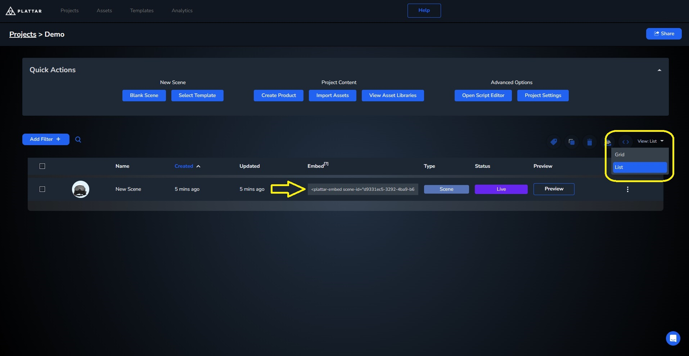
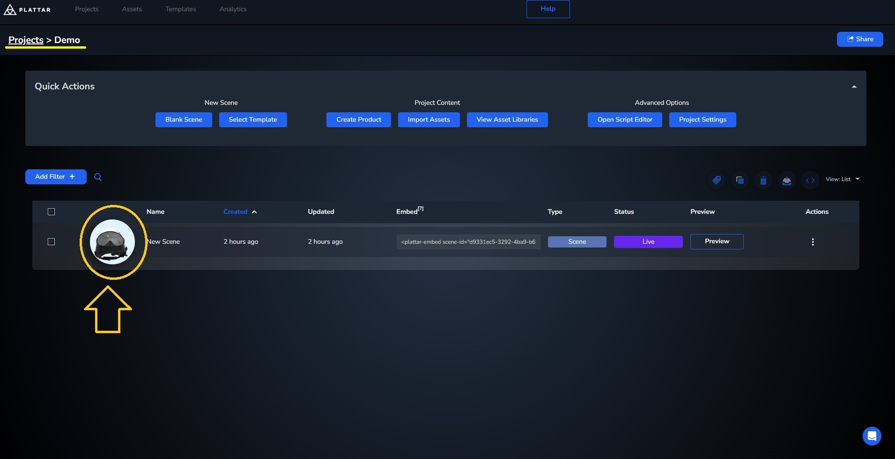
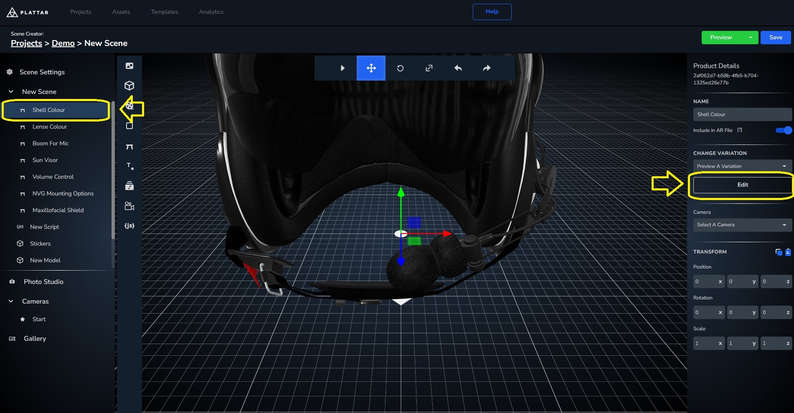
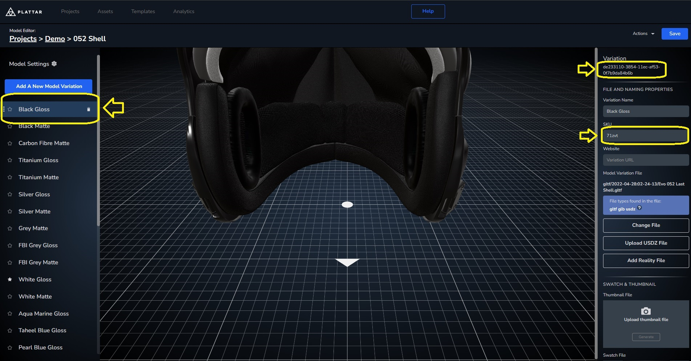

[Back to Main](./)

# Configurator/Viewer Integrations with AR

The plattar-ar-adapter SDK is bundled with functionality that allows integrating a Plattar Configurator and 360 Viewer renderer into existing websites.

The Configurator exposes a set of interfaces and functionality that allows switching product states, loading existing configuration states and launching AR functionality for IOS and Android devices.

As of version `1.154.1` The SDK makes the Configurator as the default embed type. 

## Quick start

To start, we'll begin with a simple example showing the most basic example for a 360 integration 

- First, we'll need to [install](../installation/installation.md) the plattar plugin, which can easily be done by adding this embed code into your website
    ```html
    <script src="https://sdk.plattar.com/plattar-plugin.min.js"></script>
    ```

- Next, we'll need to add an embed code that will show the 3d model. Luckily, The CMS can provide you with the embed tag you need, complete with its scene ID with only a few clicks
To access an embed code from any scene, navigate to your project page, change the view setting to list, and copy the embed code by clicking on it
{ width=1000px }


For this example, we'll use [attributes](../guides/node-attributes.md) to change the look of the embed. Using ```show-ui="true"``` to add a simple UI complete with its variation, and ```width="100%"``` to change its width to fill the screen.
<iframe height="600" style="width: 100%;" scrolling="no" title="Quick Start" src="https://codepen.io/plattar/embed/JoPaOge?default-tab=html%2Cresult&editable=true" frameborder="no" loading="lazy" allowtransparency="true" allowfullscreen="true">
  See the Pen <a href="https://codepen.io/plattar/pen/JoPaOge">
  Quick Start</a> by Plattar (<a href="https://codepen.io/plattar">@plattar</a>)
  on <a href="https://codepen.io">CodePen</a>.
</iframe>

## Changing Between Scenes
### Getting the Scene ID
Before we start, we first have to get a `Scene ID` from multiple scenes we'd like to change between. The `Scene ID` can be copied directly from the Plattar CMS. This ID is static for the duration of the Scene's existance and will not change when the scene is modified. Each Scene contains a unique GUID (Global Unique Identifier).

- Click on your Scene to enter the Scene Editor 
{ width=1000px }

- Copy the `Scene ID` from the Scene Editor and use as part of the `scene-id` attribute in the integration (this is not disimilar to copying the embed tag)
{ width=1000px }

### Changing the Loaded Scene using Scene ID
Once we've acquired the `Scene ID`, we can now change the `scene-id` directly in the embed. the Plattar plugin will automaticallly change the loaded scene whenever the `scene-id` is changed.

In this example we use a simple drop-down selector to change between 3 scenes
<iframe height="600" style="width: 100%;" scrolling="no" title="Changing Scene" src="https://codepen.io/plattar/embed/raBqJMb?default-tab=html%2Cresult&editable=true" frameborder="no" loading="lazy" allowtransparency="true" allowfullscreen="true">
  See the Pen <a href="https://codepen.io/plattar/pen/raBqJMb">
  Changing Scene</a> by Plattar (<a href="https://codepen.io/plattar">@plattar</a>)
  on <a href="https://codepen.io">CodePen</a>.
</iframe>


## Changing Between Variation
### Getting Variation ID 

Just like changing scenes, before we can change variation we first have to get their ids. For variation in a single scene, the `Variation ID` and `SKU` can be copied from the Plattar CMS through the editor, not too disimilar to `Scene ID`
- Navigate to the editor of a scene you'd like to ger the `variation-id` from

- Select an object in the scene you'd like to change to a variation
{ width=1000px }

- In the variation Editor, pick one of the variation available and copy the `Variation ID` or `SKU` and use to change to a variation either by changing the attribute or function
{ width=1000px }


### Changing Variation Using Attribute
There are multiple ways to change a variation in a scene, either by changing the [attribute](../guides/node-attributes.md) of the embed or through a [function](../guides/node-attributes.md). You also have the choice between using a `Variation ID` or a user defined `SKU`
In the first example, we'll use attributes to change between  `Variation ID`s and `SKU`
>Note that When using multiple `variation-id` the ids are separated using a **comma without space**

<iframe height="600" style="width: 100%;" scrolling="no" title="Changing Variation Using Function" src="https://codepen.io/plattar/embed/mybzxVK?default-tab=js%2Cresult&editable=true" frameborder="no" loading="lazy" allowtransparency="true" allowfullscreen="true">
  See the Pen <a href="https://codepen.io/plattar/pen/mybzxVK">
  Changing Variation Using Function</a> by Plattar (<a href="https://codepen.io/plattar">@plattar</a>)
  on <a href="https://codepen.io">CodePen</a>.
</iframe>


### Changing Variation Using Function
In the second example, we'll use function instead which offers better redundency and error handling especially when changing between multiple `variation-id`s

<iframe height="600" style="width: 100%;" scrolling="no" title="Changing variation Using Attribute" src="https://codepen.io/plattar/embed/RNbeQdx?default-tab=js%2Cresult&editable=true" frameborder="no" loading="lazy" allowtransparency="true" allowfullscreen="true">
  See the Pen <a href="https://codepen.io/plattar/pen/RNbeQdx">
  Changing Variant Using Attribute</a> by Plattar (<a href="https://codepen.io/plattar">@plattar</a>)
  on <a href="https://codepen.io">CodePen</a>.
</iframe>


## Viewing in AR

## Taking a Screenshot

## Show QR Code to open on mobile

<!-- 
## Getting Multiple Scene ID's and Variation as a JSON

For multiple Scene integrations and their variants, all of their ID can be bundled into a json from the Plattar CMS instead of accessing each one of them manully. This exported JSON file can then be used to manage the integrations of multiple scenes through the use of Json manipulation.

- Click on your Project in the Plattar CMS and navigate to the Scene List
- Select the Scene's ready for integration
- Export the generated JSON file containing all the integration URL's and codes for the selection


## Configurator/Viewer Integration Example with Variation Switching 

For the purposes of this example, we use a sample `scene-id` of `c49e5c30-469c-11ec-963f-ddbb1b50e719`.

This scene contains multiple products with multiple variations that can be configured using a simple UI. It performs the following functionality.

- Configure multiple products with variations using `selectVariation` and a simple UI
- Generate QR Code for launching AR Mode for Desktop against a specific configuration
- Launch AR Experience when viewed from mobile

### End Result

<iframe height="1000" style="width: 100%;" scrolling="no" title="Configurator Integration" src="https://codepen.io/plattar/embed/VwxWJgL?default-tab=html%2Cresult" frameborder="no" loading="lazy" allowtransparency="true" allowfullscreen="true">
  See the Pen <a href="https://codepen.io/plattar/pen/VwxWJgL">
  Configurator Integration</a> by Plattar (<a href="https://codepen.io/plattar">@plattar</a>)
  on <a href="https://codepen.io">CodePen</a>.
</iframe>
-->