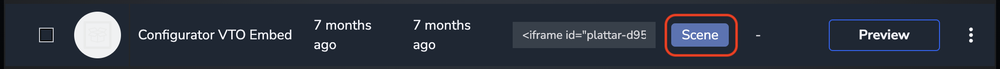
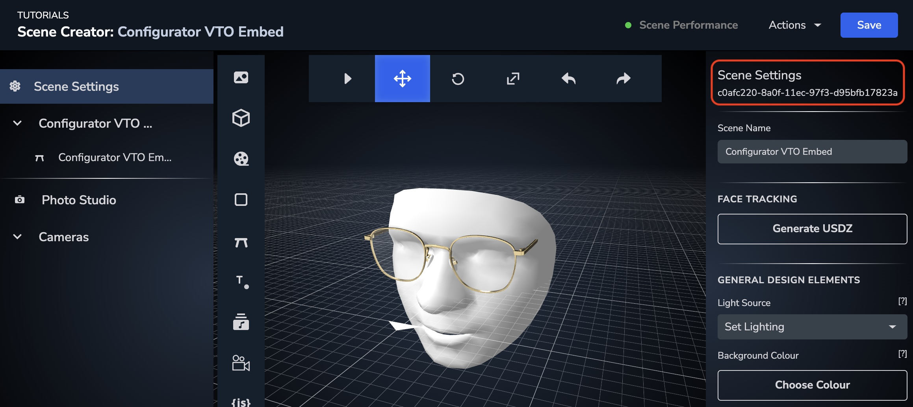
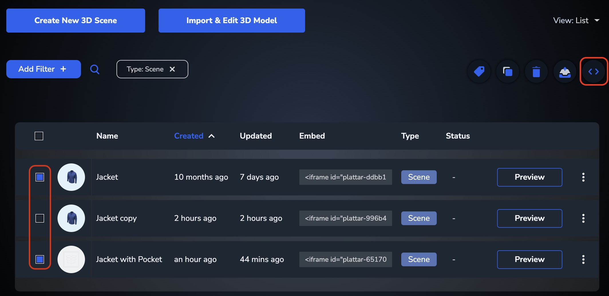

[Back to Home](/)

# Virtual Try-On (VTO) Integration

The plattar-ar-adapter SDK is bundled with functionality that allows integrating a Plattar VTO renderer into existing websites.

The VTO exposes a set of interfaces and functionality that allows switching product states, loading existing configuration states and launching AR functionality for iOS, Android and Desktop.

## Node Attributes

### Required Attributes

#### scene-id

Scene ID is acquired from the Plattar CMS. Every Scene in the Plattar Ecosystem is designated a unique GUID. Use that Scene ID to embed a particular VTO onto your website.

```html
<plattar-embed scene-id="" />
```

#### embed-type

The `embed-type` attribute should always equal to `vto` for a VTO embed. This will expose the underlying interfaces and AR functionality.

```html
<plattar-embed scene-id="" embed-type="vto" />
```

### Optional Attributes

#### variation-id

Comma-separated list of Variation IDs that can be used to define a specific or particular configuration of Products. The Variation IDs can be acquired from the Plattar CMS.

```html
<plattar-embed scene-id="" variation-id="" />
```

#### variation-sku

Comma-separated list of user-defined Variation SKUs that can be used to define a specific or particular configuration of Products. The Variation SKUs are both defined and acquired from the Plattar CMS.

```html
<plattar-embed scene-id="" variation-sku="" />
```

#### show-ar

The `show-ar` attribute will display a UI button that allows a user to launch an Android or iOS AR experience for a provided scene configuration. This attribute is ignored on desktop platforms. This attribute is `false` by default.

```html
<plattar-embed scene-id="" show-ar="true" />
```

#### width & height

The `width` and `height` attributes will scale the internal renderer and QR Code to the provided size. These attributes are `500px` by default.

```html
<plattar-embed scene-id="" width="700px" height="700px" />
```

#### ar-mode

The `ar-mode` attribute controls how AR is launched. The default setting is `generated` which will bundle and generate an AR file using all Products and Variations in the Scene.

An alternative mode is using `inherited` which will use the pre-generated/user-uploaded `glb`, `usdz` and `reality` files attached to Products and Variations. When using `inherited` mode, no combinations will be performed so it's only suitable when there is a single Product/Variation in the Scene.

This attribute is `generated` by default.

```html
<plattar-embed scene-id="" ar-mode="generated" />
```

## Messenger Functions for VTO

The following renderer functions are available:

### selectVariationID

Activates the provided Product Variation using a Variation ID. The Variation ID must be a member of a Scene Product in the Scene. The argument can be either a single Variation ID or an Array of Variation IDs.

```javascript
viewer.messenger.selectVariationID(variationID: string | Array<string>);
```

### selectVariationSKU

Activates the provided Product Variation using a user-defined Variation SKU. The Variation SKU must be a member of a Scene Product in the Scene. The argument can be either a single Variation SKU or an Array of Variation SKUs.

```javascript
viewer.messenger.selectVariationSKU(variationSKU: string | Array<string>);
```

## Getting the Scene ID

For individual Scene integrations, the `Scene ID` can be copied directly from the Plattar CMS. This ID is static for the duration of the Scene's existence and will not change when the scene is modified. Each Scene contains a unique GUID (Global Unique Identifier).

**Ensure that your Scene is a proper `VTO` Scene with a Face Marker attached.** Use the virtual face as a guideline to position your content.

### Steps to Get Scene ID

1. Click on your Project in the Plattar CMS and navigate to the Scene List

   

2. Click on your Scene to enter the Scene Editor

   

3. Copy the `Scene ID` from the Scene Editor and use as part of the `scene-id` attribute in the integration

## Multiple Scene IDs

For multiple Scene integrations, the embed codes can be generated and exported directly from the Plattar CMS. This exported JSON file can then be used to manage the integrations of multiple scenes.

### Steps to Export Multiple Scenes

1. Click on your Project in the Plattar CMS and navigate to the Scene List
2. Select the Scenes ready for integration
3. Export the generated JSON file containing all the integration URLs and codes for the selection



## VTO Embed Example

For the purposes of this example, we use a sample `scene-id` of `c0afc220-8a0f-11ec-97f3-d95bfb17823a`.

This scene contains multiple products with variations that can be configured using a simple UI. It performs the following functionality:

- Configure products with variations using `selectVariation` and a simple UI
- Launch Reality VTO Experience for supported iOS Devices
- Launch 360 Viewer Experience for iOS, Android and Desktop Devices
- Launch VTO Experience for Desktop and Android Devices

```html
<html>

<head>
  <title>Plattar VTO Integration Example</title>
  <meta name="viewport" content="width=device-width, user-scalable=no, minimum-scale=1.0, maximum-scale=1.0">
  <style type="text/css">
    body {
      font-family: sans-serif;
    }
  </style>
  <script src="https://cdn.jsdelivr.net/npm/@plattar/plattar-ar-adapter/build/es2019/plattar-ar-adapter.min.js"></script>
</head>

<body>
  <!-- UI Organisation -->
  <form id="ios_mobile">
    <b>This button will launch the iOS Reality Composer VTO Experience</b>
    <button type="button" onclick="launchAR()">Launch iOS AR</button>
  </form>
  
  <form id="viewer_360">
    <b>This button will launch a 360/Viewer Experience for Android, iOS and Desktop</b>
    <button type="button" onclick="launchViewer()">Launch 360 Viewer</button>
  </form>
  
  <form id="vto">
    <b>This Button will launch the Android/Desktop VTO Experience</b>
    <button type="button" onclick="launchVTO()">Launch VTO</button>
  </form>
  
  <form id="vto_selectors" hidden>
    <b>Select Glasses Variation</b>
    <select id="glasses_variation" onchange="selectVariation('glasses_variation')">
      <option value='99158d40-8a0f-11ec-af7c-ab107e3c74a9'>Glasses 1</option>
      <option value='a24e23d0-8a0f-11ec-ac25-81e812550857'>Glasses 2</option>
    </select>
  </form>
  
  <!-- This is the embed that will be used for Desktop/Android VTO -->
  <plattar-embed 
    id="embed" 
    scene-id="c0afc220-8a0f-11ec-97f3-d95bfb17823a" 
    embed-type="vto">
  </plattar-embed>
  
  <script>
    // Decide which UI components we want to display and which to keep hidden
    const iosMobile = document.getElementById("ios_mobile");
    const viewer360 = document.getElementById("viewer_360");
    const vto = document.getElementById("vto");

    // Test for iOS Mobile and RealityKit support
    if (PlattarARAdapter.Util.canAugment() && PlattarARAdapter.Util.canRealityViewer()) {
      // disable the desktop/android vto button
      vto.querySelector('button').disabled = true;
    }
    // Test for Desktop and Android Mobile
    else {
      // disable the ios vto button
      iosMobile.querySelector('button').disabled = true;
    }

    // This will launch a Reality VTO for provided scene-id
    // requires embed-type="vto" otherwise AR will be world placement
    async function launchAR() {
      const embed = document.getElementById("embed");

      if (embed) {
        try {
          await embed.startAR();
        }
        catch (err) {
          console.error(err);
        }
      }
    }

    // This will remove the VTO experience and start a 360 experience
    // 360 Viewer works on all devices
    async function launchViewer() {
      const embed = document.getElementById("embed");

      if (embed) {
        embed.setAttribute("embed-type", "configurator");
        embed.setAttribute("init", "viewer");

        // enable variation selectors
        const selectors = document.getElementById("vto_selectors");
        selectors.hidden = false;
      }
    }

    // This will remove the 360 experience and start a VTO experience
    // VTO Experiences works on Desktop and Android devices
    async function launchVTO() {
      const embed = document.getElementById("embed");

      if (embed) {
        embed.setAttribute("embed-type", "vto");
        embed.setAttribute("init", "viewer");

        // enable variation selectors
        const selectors = document.getElementById("vto_selectors");
        selectors.hidden = false;
      }
    }

    // This is called when the dropdowns change
    // used to switch the variations
    async function selectVariation(id) {
      // these are the scene product IDs mapped into our IDs
      const dropdown = document.getElementById(id);

      // get the user selections
      const selection = dropdown.options[dropdown.selectedIndex].getAttribute('value');
      const embed = document.getElementById("embed");

      // perform the variation selection
      if (embed) {
        await embed.viewer.messenger.selectVariationID(selection);
      }
    }
  </script>
</body>

</html>
```

## VTO Scene Requirements

For VTO to work properly, your scene must:

1. **Have a Face Marker**: Attach a face marker to your scene in the CMS
2. **Position Content Correctly**: Use the virtual face guide to position your products
3. **Optimize Models**: Ensure 3D models are optimized for real-time rendering
4. **Test on Devices**: VTO experiences should be tested on actual mobile devices

## Platform Support

### iOS (Reality Composer)
- Best experience with ARKit
- Supports face tracking
- High-quality rendering

### Android
- Camera-based VTO
- Works on most modern Android devices
- Good performance on mid-range devices

### Desktop
- Webcam-based VTO
- Requires webcam permission
- Works in modern browsers (Chrome, Firefox, Safari, Edge)

## CodePen Live Example

<iframe height="600" style="width: 100%;" scrolling="no" title="VTO Integration" src="https://codepen.io/plattar/embed/MWGoMLB?default-tab=html%2Cresult" frameborder="no" loading="lazy" allowtransparency="true" allowfullscreen="true">
  See the Pen <a href="https://codepen.io/plattar/pen/MWGoMLB">
  VTO Integration</a> by Plattar (<a href="https://codepen.io/plattar">@plattar</a>)
  on <a href="https://codepen.io">CodePen</a>.
</iframe>

## Best Practices

### Performance

- **Optimize 3D Models**: Keep polygon counts reasonable (under 50k triangles)
- **Texture Sizes**: Use compressed textures when possible
- **Loading States**: Show loading indicators while the VTO initializes

### User Experience

- **Permissions**: Request camera permissions with clear explanations
- **Lighting Instructions**: Advise users on proper lighting conditions
- **Fallbacks**: Provide alternative viewing options if VTO is unavailable
- **Device Detection**: Show appropriate UI based on device capabilities

### Testing

- **Multiple Devices**: Test on various iOS and Android devices
- **Different Lighting**: Test in various lighting conditions
- **Face Positions**: Test with different face angles and positions
- **Performance**: Monitor frame rates and loading times

## Related Guides

- [Configurator Integration](integrations/configurator-integration.md) - 360 Viewer & Configurator
- [View in AR](installation/view-ar.md) - AR functionality
- [API Reference](installation/api-reference.md) - Complete API documentation
